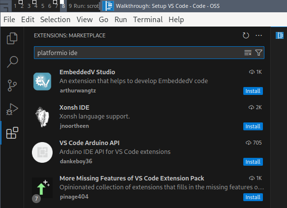
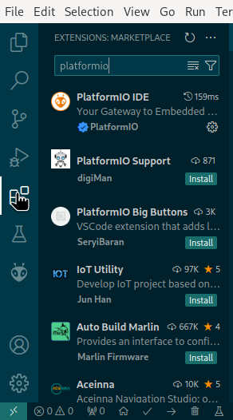
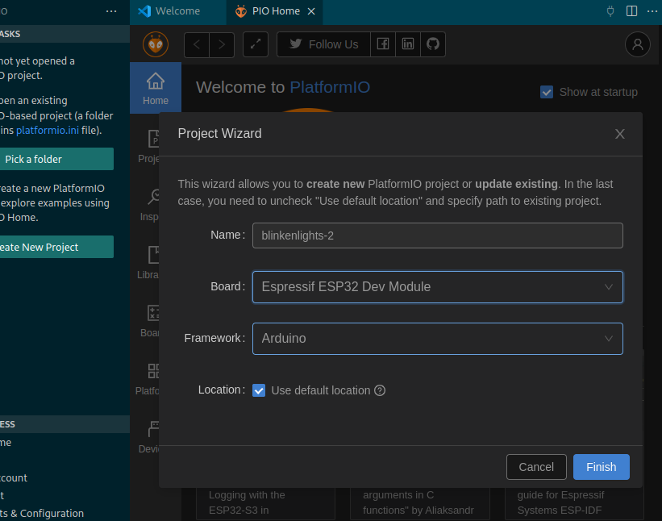
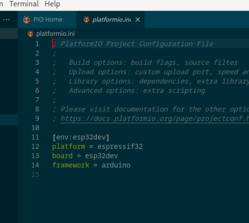
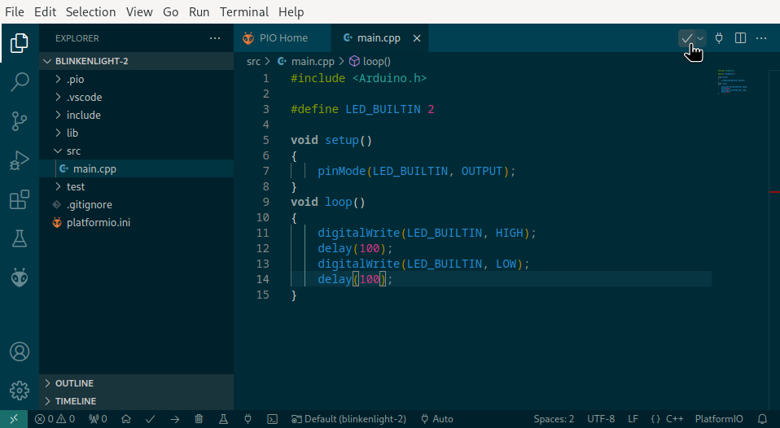

## General information

The devboard plugs in with micro-USB. A red light will light up when plugged in.

Make sure that /dev/ttyUSB0 shows up before continuing. If not, you may need to install a serial USB driver.

## PlatformIO and Arduino framework (VSCode IDE)
1. Install VSCode on your system, and start it for the first time. When I tried in late 2024, only the binary version worked, not the open source version. (Picture of missing extension in OSS version)

2. Click the blocks icon on the left bar, or View > Extensions on the top menu, to open the Extensions section. Search for "PlatformIO IDE" and install the extension. 

3. After installing, make a new project. Select "ESP32 Dev Module" as your board. You can pick whatever name and location you want. For the example framework I'm going to use Arduino.

4. A new project has been created.

5. On the file browser on the left, open 'src' and navigate to 'main.cpp'. Replace the contents by the following code to make an LED blink.

6. Click the checkmark button at the top right, which says "Build" if you hover the mouse. This builds the project, ensuring that your code is correct.
7. Clicking the dropdown right next to the checkmark, you should see these options: "Build", "Upload", "Test", and "Clean". Select "Upload". Your project will build again, and you should see the LED on your ESP32 start blinking.

## ArduinoIDE
1. In the Arduino IDE, enter the board manager (Tools -> Board: XXX -> Board Manager)
2. Install "esp32" provided by Espressif Systems.
3. Select the board "ESP32 Dev Module"
4. Set the upload baud rate to 115200

## PlatformIO and Arduino framework (core, on command line)
1. Install platformio-core
2. In a new directory, run `pio project init`
3. Edit platformio.ini to include the following

       [platformio]
       default_envs = arduino

       [env:arduino]
       framework = arduino
       platform = espressif32
       board = esp32dev
       upload_port = /dev/ttyUSB0

4. Add a file src/blink.cpp

       #include <Arduino.h>
       
       #define LED_BUILTIN 2
       
       void setup()
       {
           pinMode(LED_BUILTIN, OUTPUT);
       }
       void loop()
       {
           digitalWrite(LED_BUILTIN, HIGH);
           delay(1000);
           digitalWrite(LED_BUILTIN, LOW);
           delay(1000);
       }

5. Run `pio run` to make sure the project builds.
6. Run `pio run --target upload` to both build and upload the project.

## PlatformIO and esp-idf framework (core, on command line)
1. Install platformio-core
2. In a new directory, run `pio project init`

           [platformio]
           default_envs = espidf

           [env:espidf]
           framework = espidf
           platform = espressif32
           board = esp32dev
           upload_port = /dev/ttyUSB0

3. Add a file src/blink.c

           #include "driver/gpio.h"
           #include "freertos/FreeRTOS.h"
           #include "freertos/task.h"

           #define BLINK_GPIO ((gpio_num_t)2)

           void app_main(void) {
               gpio_reset_pin(BLINK_GPIO);
               /* Set the GPIO as a push/pull output */
               gpio_set_direction(BLINK_GPIO, GPIO_MODE_OUTPUT);
               while(1) {
                   gpio_set_level(BLINK_GPIO, 0);
                   vTaskDelay(1000 / portTICK_PERIOD_MS);
                   gpio_set_level(BLINK_GPIO, 1);
                   vTaskDelay(1000 / portTICK_PERIOD_MS);
               }
           }

5. Run `pio run` to make sure the project builds. This might take a while the first time.
6. Run `pio run --target upload` to both build and upload the project.

## How to flash with esptool.py
1. Plug in the dev board.
2. Generate `program-image.bin` using the tool of your choice. How to do that is outside the scope of this tutorial.
3. Run 
    esptool.py --port /dev/ttyUSB0 -b 115200 write_flash 0x10000 /path/to/program-image.bin

#### BOOT and EN buttons

To program, you do not need to press either one -- this should be handled for you.

- **EN** = refresh
- **BOOT** = enter bootloader
