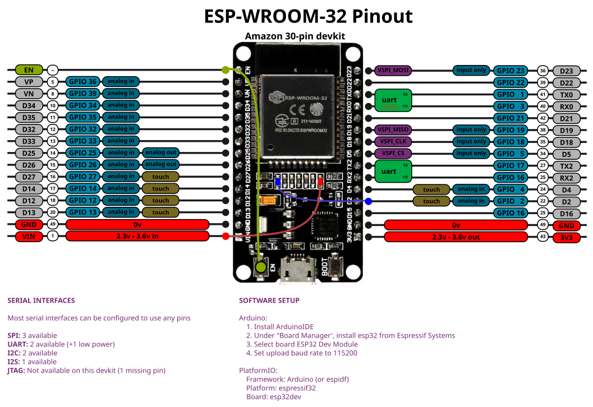

A short bit of documentation about the ESP-WROOM-32 sold on Amazon, and how to set up a development environment for it.

1. [Set Up](HOWTO.md) on Arduino IDE, PlatformIO, and command line. (All on Linux but most steps apply on Windows or OS X)
2. [Tech Specs](ABOUT.md)
3. [Power Usage](POWER.md)
